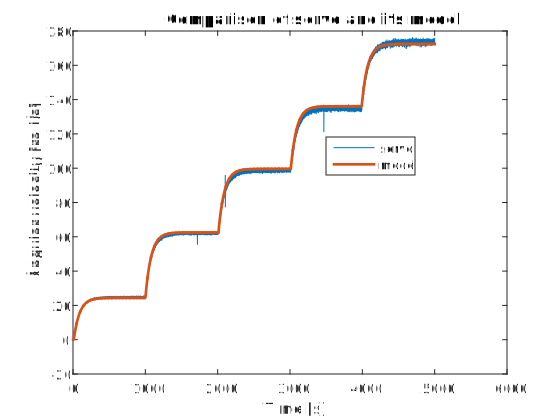
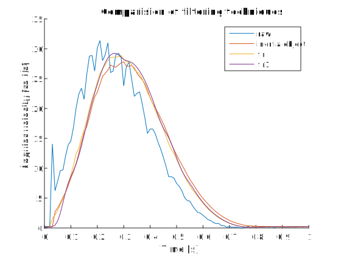

# Servomechanism control
## Capstone Project
`Karol Rola`

`Piotr Ogórek`

`Piotr Kozimor`

This project aims to design controller for servomechanism.

## Proposed mathematical model

Equation 1:
$$
v(t) = Ri(t)+ K_e\omega(t) \\
J\dot{\omega}(t) = K_mi(t) - \beta\omega(t)-f_0*sgn(\omega) \\
$$
where: \
$v(t)$ - input voltage \
$i(t)$ - armature current \
$\omega(t)$ - angular velocity of the rotor \
$R$ - resistance of armature winding \
$J$ - moment of inertia of the moving parts \
$\beta$ - damping coefificient due to viscous friction \
$K_e\omega(t)$ - back EMF \
$K_mi(t)$ - electromechanical torque

## Sensors scaling

### Motor Encoder
Rotor of DC motor was rotated 10 times. Obtaning raw measurements gave us following results:
| Start position | Final position |
| - | - |
| -92.7568 | -155.4122 |

$$
(enc_f - enc_s)/ 10/ 2 =-3.1328
$$
The result is close to $\pi$. That meas that enccoer reading is already scaled to radians.

### Input Encoder
Absolute encoder, produces output with range [-99.11, 97.61]. Additional processing is neccessary for continous angle measurement.

### Tachometer
We have acquired data for steady state conditions for 5 given outputs. Then we compare tachometer and encoder outputs. Given below chart we have noticed that the tachometer output is already scaled to $rad/s$.

## Identification

### Motor Inertia

Given the datasheet parameter motor inertia is established as:

$J_M = 1.8 * 10^{-5}  [kg*m^2]$

### Motor torque constant

$$
k=5.3[\frac{mNm}{A}]=5.3*10^{-3}[\frac{V*s}{rad}]
$$

Comparing the real model and our simulations we found out that the motor torque constant provided by the manufacturer can be invalid. In order to address this issue we perfomed an experiment to identify the real motor torque constent.

Using torque sensor and current measurment we calculeted proper value of the motor torque constant.

| Set point | Current [A] | Torque [N*cm] |
| - | - | - |
| 0.25 | 1.2 | 6 |
| 0.5 | 2.5 | 12.1 |
| 0.75 | 3.9 | 18 |
| -0.25 | -1.15 | -5.5 |
| -0.5 | -2.4 | -12.8 |
| -0.75 | -3.6 | -18 |

### Motor coil inductance

$L_M=1[mH]$

### Rotating mass inertia

Rotating mass has following dimensions and mass:

Inertia of the solid cylinder is given by the following equation:

$J_{SM}=\frac{1}{2}mr^2=1.1*10^{-3} [kg*m^2]$

### Resistance of the net
First of all we have mesure the voltage of idle DC motor. In order to accomplish this task we have disconnected the DC motor power supply and measure the voltage value which is given below:\
 $U=6.65 [V]$ 

Then after reconnecting the motor we have locked the motor and measure the current with help of current probe. The result is given below:\
$I=2.45 [A]$

Finally we have used well-known Ohm formula to calculate resistance of the net:

$$
R=U/I \\
R=6.65/2.45=2.71 [\Omega]
$$

### Friction

In order to identify damping coefficient we have followed equations:

$$ 
 v = Ri + k\omega \\
 ki = \beta\omega + f_0
$$
They have been derived from the mathematical model, taking into account that we examine the system in steady-state. \
$f_0$ - statci friction coefficient

After combining the equations, we have got:

$$
f_0 + \beta\omega = \frac{k}{R}v - \frac{k^2}{R}\omega
$$

The right side we have signed as RHS and on the left we have got linear function of $\omega$. Now, the task was to find the coefficients of the function. We have used the data from the experiment described above in 'Tachometer' part. 
After choosing 5 points, we have calculated RHS for appropriate values of v and $\omega$. Then we have used Basic Fitting tool to find the coefficients of the linear function.

We have got:

Having identified the motor constant, he have repeated the identifiaction of friction coeficients:

$$
f_0 = 1.8*10^{-3}  \\
\beta = 3.6*10^{-4}
$$

## Coast test

In order to check the validity of friction coefficients we have conducted an experiment, called coast test. Then, we compared it with model simulation. The results, presented below, show that the coefficients were calculated correctly.

## Servo model

We have created folowing model of servo, according to Equation 1:

The comparison of acquired data and model gace the following results:

## Control algorithm considerations

PID regulator can be implemented for control of plant. This method can be easily introduced as long as it require little knowledge of system dynamics.

There is a better idea. Considerating system dynamics, one can employ cascaded control system.
The diagram below shows idea of such control system:

The structure is as follows:

| Controller | Controlled variable | Implemented |
| - | - | - |
| primary, outermost, master | position | yes |
| secondary controler | velocity | yes |
| tertiary, inner-most | current | no |

## Secondary PID controller tuning

Using Ziegler–Nichols method, we found out that $P = 2,5$ causes instability in system respone. $P = 1.25$ therefore.

However, test on the plant showed instability of system. Using heuristic/empirical method we found out optimal gain value: $P = 0.03$.

## Primary PID controller tuning

using method as above we found optimal setting for PID:

$P = 5 \\ I = 0.1$

## Filtering consideration
The tests on real plant showed that filtering of velocity signal is critical to quality of regulation. 

The figure below shows comaprision of filtering techniques, compared to raw signal:

 - inertia object $G(S) = \frac{1}{0.05s + 1}$
 - fir coefficients $fir_coeff = [1,1,1,1,1,1,1,1,1,1]$
 - fir1 coefficients $fir\_coeff1 = fir1(10, 0.15)$

## Feedforward control

### PID tuning

The following test stand was implemented to tune PID controller:

The results of PID tuning:

Transfer function of PID:
$$
G(s) = P + I \frac{1}{s} + D \frac{N}{1 + N\frac{1}{s}}
$$
Coefficents:
$$
P = 28 \\
I = 23 \\
D = 7.6 \\
N = 22.7 \\
$$

# Useful links

[Manufacturer website](http://www.inteco.com.pl/products/modular-servo/)

[Test stand documentation](https://drive.google.com/file/d/1F0foLas4g3s24JEOM_dqSUn_Qu4ZN-Qn/view?usp=sharing)

[Motor datasheet](http://www.buehler-motor.pl/download/DC%20Motor_51%20x%2088_1.13.044.2XX.pdf)