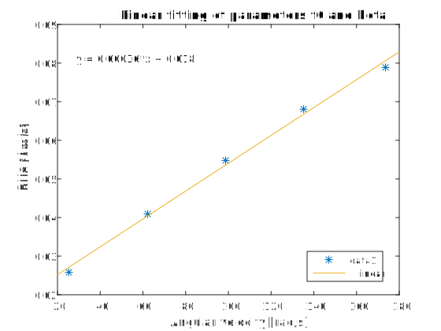
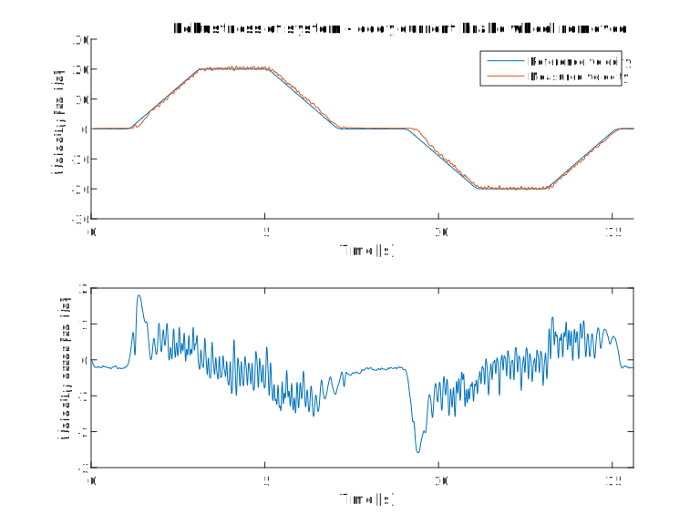

- [Overview](#overview)
- [Proposed mathematical model](#proposed-mathematical-model)
- [Sensors scaling](#sensors-scaling)
  - [Motor Encoder](#motor-encoder)
  - [Input Potentiometer](#input-potentiometer)
  - [Tachometer](#tachometer)
- [Identification](#identification)
  - [Motor Inertia](#motor-inertia)
  - [Motor torque constant](#motor-torque-constant)
  - [Motor coil inductance](#motor-coil-inductance)
  - [Rotating mass inertia](#rotating-mass-inertia)
  - [Resistance of the net](#resistance-of-the-net)
  - [Friction](#friction)
  - [Coast test](#coast-test)
- [Model evaluation](#model-evaluation)
- [Controller](#controller)
  - [Secondary PID controller tuning](#secondary-pid-controller-tuning)
  - [Primary PID controller tuning](#primary-pid-controller-tuning)
  - [Filtering consideration](#filtering-consideration)
  - [Feedforward control - trajectory generator](#feedforward-control---trajectory-generator)
  - [PID tuning](#pid-tuning)
- [Controller evaluation](#controller-evaluation)
  - [Setpoint following](#setpoint-following)
  - [Setpoint following without trajectory generator](#setpoint-following-without-trajectory-generator)
  - [Disturbance rejection](#disturbance-rejection)
  - [Robustness](#robustness)
- [Conclusions](#conclusions)
- [References](#references)

## Overview
This project aims to design controller for Modular Servo System(**MSS**). The **MSS** consists of several parts mounted together at the metal rail and arranged in the chain:
 - the DC motor with the tachogenerator,
 - inertia load,
 - encoder,
 - eddy current brake,
 - gearbox with the output disk.

The rotation angle of the DC motor shaft is measured using an incremental encoder. A tachogenerator is connected directly to the DC motor and generates a voltage signal proportional to the angular velocity. 

The servomechanism is connected to a computer where a control algorithm is realized
based on measurements of angle and angular velocity. The accuracy of measurement of velocity is 5% while the accuracy
of angle measurement is 0.1%. The armature voltage of the DC motor is controlled by PWM
signal. For this reason the dimensionless control signal is the scaled input voltage,
$u(t)=v(t)/v_{max}$. The admissible controls satisfy $|u(t)|\leq1$ and $v_{max} =12 V$.

The measurement system is based on RTDAC/USB2 acquisition board equipped with A/D
converters.

The I/O board communicates with the power interface unit. The whole logic necessary to
activate and read the encoder signals and to generate the appropriate sequence of PWM pulses
to control the DC motor is configured in the Xilinx chip of the RT-DAC/USB2 board. All
functions of the board are accessed from the Modular Servo Toolbox which operates directly
in the MATLAB/Simulink environment.
## Proposed mathematical model

Equation 1:
$$
v(t) = Ri(t)+ K_e\omega(t) \\
J\dot{\omega}(t) = K_mi(t) - \beta\omega(t)-f_0\cdot sgn(\omega) \\
$$
where: \
$v(t)$ - input voltage \
$i(t)$ - armature current \
$\omega(t)$ - angular velocity of the rotor \
$R$ - resistance of armature winding \
$J$ - moment of inertia of the moving parts \
$\beta$ - damping coefificient due to viscous friction \
$K_e\omega(t)$ - back EMF \
$K_mi(t)$ - electromechanical torque

## Sensors scaling

### Motor Encoder
Rotor of DC motor was rotated 10 times. Obtaning raw measurements gave us following results:
| Start position | Final position |
| - | - |
| -92.7568 | -155.4122 |

$$
(enc_{finish} - enc_{start})/ 10/ 2 =-3.1328
$$
The result is close to $\pi$. That meas that encoder reading is already scaled to radians.

### Input Potentiometer
Absolute potentiometer, produces output with range [-99.11, 97.61]. Additional processing is neccessary for continous angle measurement.

### Tachometer
We have acquired data for steady state conditions for 5 given outputs. Then we compare tachometer and encoder outputs. Given below chart we have noticed that the tachometer output is already scaled to rad/s.

## Identification

### Motor Inertia

Given the datasheet parameter motor inertia is established as:

$$J_M = 1.8  \cdot  10^{-5} \;  kg \cdot m^2$$

### Motor torque constant

$$
k=5.3 \;\frac{mNm}{A}=5.3 \cdot 10^{-3} \; \frac{V \cdot s}{rad}
$$

Comparing the real model and our simulations we found out that the motor torque constant provided by the manufacturer can be invalid. In order to address this issue we perfomed an experiment to identify the real motor torque constent.

Using torque sensor and current measurment we calculeted correct value of the motor torque constant.

| Set point | Current [A] | Torque [Ncm] |
| - | - | - |
| 0.25 | 1.2 | 6 |
| 0.5 | 2.5 | 12.1 |
| 0.75 | 3.9 | 18 |
| -0.25 | -1.15 | -5.5 |
| -0.5 | -2.4 | -12.8 |
| -0.75 | -3.6 | -18 |

### Motor coil inductance

$$L_M=1.0\;mH$$

### Rotating mass inertia

Rotating mass has following dimensions and mass:

Inertia of the solid cylinder is given by the following equation:

$$J_{SM}=\frac{1}{2}mr^2=1.1 \cdot 10^{-3} \;kg \cdot m^2$$

### Resistance of the net
First of all we have mesure the voltage of idle DC motor. In order to accomplish this task we have disconnected the DC motor power supply and measure the voltage value which is given below:\
 $U=6.65 V$ 

Then after reconnecting the motor we have locked the motor and measure the current with help of current probe. The result is given below:\
$I=2.45 \;A$

Finally we have used well-known Ohm formula to calculate resistance of the net:

$$
R=U/I \\
R=6.65/2.45=2.71 \; \Omega
$$

### Friction

In order to identify damping coefficient we have followed equations:

$$ 
 v = Ri + k\omega \\
 ki = \beta\omega + f_0
$$
They have been derived from the mathematical model, taking into account that we examine the system in steady-state. \
$f_0$ - static friction coefficient

After combining the equations, we have got:

$$
f_0 + \beta\omega = \frac{k}{R}v - \frac{k^2}{R}\omega
$$

The right side we have signed as RHS and on the left we have got linear function of $\omega$. Now, the task was to find the coefficients of the function. We have used the data from the experiment described above in 'Tachometer' part. 
After choosing 5 points, we have calculated RHS for appropriate values of v and $\omega$. Then we have used Basic Fitting tool to find the coefficients of the linear function.

We have got:

$$
f_0 = 1.8 \cdot 10^{-3}  \\
\beta = 3.6 \cdot 10^{-4}
$$

### Coast test

In order to check the validity of friction coefficients we have conducted an experiment, called coast test. Then, we compared it with model simulation. The results, presented below, show that the coefficients were calculated correctly.

## Model evaluation

We have created folowing model of servo, according to Equation 1:

The comparison of acquired data and model yields the following results:

## Controller

PID regulator can be implemented for control of plant. This method can be easily introduced as long as it require little knowledge of system dynamics.

There is a better idea. Considerating system dynamics, one can employ cascaded control system.
The diagram below shows idea of such control system:

The structure is as follows:

| Controller | Controlled variable | Implemented |
| - | - | - |
| primary, outermost, master | position | yes |
| secondary controler | velocity | yes |
| tertiary, inner-most | current | no |

### Secondary PID controller tuning

Using Ziegler–Nichols method, we found out that $P = 2,5$ causes instability in system respone. $P = 1.25$ therefore.

However, test on the plant showed instability of system. Using heuristic/empirical method we found out optimal gain value: $P = 0.03$.

### Primary PID controller tuning

using method as above we found optimal setting for PID:

$$P = 5 \\ I = 0.1$$

### Filtering consideration
The tests on real plant showed that filtering of velocity signal is critical to quality of regulation. 

The figure below shows comaprision of filtering techniques, compared to raw signal:

 - inertia object $G(S) = \frac{1}{0.05s + 1}$
 - fir coefficients $fc_1 = [1,1,1,1,1,1,1,1,1,1]$
 - fir1 coefficients $fc_2 = fir1(10, 0.15)$

### Feedforward control - trajectory generator

In order to improve quality of control the simple trajectory generator was implemented. It uses pre-defined time series of acceleration to create velocity and position references. The figure below shows time series that was genereted for position, velocity and acceleration.

### PID tuning

The following test stand was implemented to tune PID controller:

The results of PID tuning:

Transfer function of PID:
$$
G(s) = P + I \frac{1}{s} + D \frac{N}{1 + N\frac{1}{s}}
$$
Coefficents:
$$
P = 28 \\
I = 23 \\
D = 7.6 \\
N = 22.7 \\
$$

## Controller evaluation

The following test were conducted in order to check control quality of system:
1. setpoint folowing
2. setpoint following without trajectory generator
3. disturbance rejection
4. robustness

### Setpoint following

### Setpoint following without trajectory generator

### Disturbance rejection

### Robustness

## Conclusions

We had issues with prameters estimation as long as the motor constant provided by manufacturer in datasheets was mistaken by orded of mangitude. We have discovered this issue by series of two tests (steady-state friction force fitting and coast test). 

After solving issue above, outputs of model and real system matches.

The PID tuning process brought a lot of suprises. In particular, the velocity controller was tuned in simulation to considerably high values of parameters. These values did not work on the plant. The identified root cause was filtering velocity signal. Having tested few method of filtering we was able to establish a stable system with lower PID parameters.

The constrol system design is roboust and non susceptible to considerably large disturbances.

We were not able to control system with inertia removed.
However, this is drastic change to system dynamic. One could design controlled handling such change, however the control quality across the all possisble dynamic would suffer.

We were not able to control system with backlash inserted between encoder and interia too. In such case one would have to probably change whole control strategy for system.

The trajectory generator brought significant improvement to the quality of the control. The system managed to catch up with the setpoint.

## References

 - [Manufacturer website](http://www.inteco.com.pl/products/modular-servo/) - http://www.inteco.com.pl/products/modular-servo/
 - [Motor datasheet](http://www.buehler-motor.pl/download/DC%20Motor_51%20x%2088_1.13.044.2XX.pdf) - http://www.buehler-motor.pl/download/DC%20Motor_51%20x%2088_1.13.044.2XX.pdf